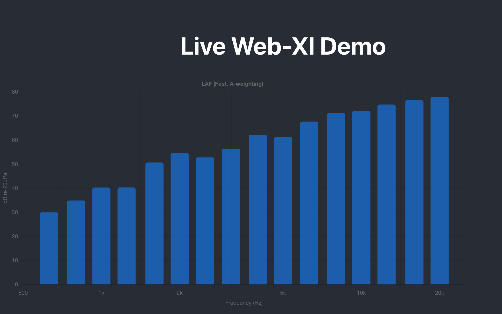

# buffer

This project has a FastAPI server that sends sine waves on a websocket. It also has a client side that is a React project to visualize the data being sent. After receiving data it adds it to a circular buffer that then holds the data until the UI is ready to take the data.


## 1st time install

#### Git
##### Mac:
use homebrew if on mac: 
```
/bin/bash -c "$(curl -fsSL https://raw.githubusercontent.com/Homebrew/install/HEAD/install.sh)"

brew install git
```

##### Windows:
Download git installer
install python from https://www.python.org/downloads/

Also set environment variables to point to python and pip

##### Set git user
```
git config --global user.name anon

git config --global user.email anon.anonsen@pm.me
```
#### Node.js
Download and install node js installer https://nodejs.org/en/download

#### Install Visual Studio code
https://code.visualstudio.com/download

##### VS Code Extensions
Git Graph

Markdown Preview

Vue

Github actions

Python

## Running the project

#### Server

Windows

```
cd server
```
```
python3 -m venv venv      # creates a folder named “venv”
source venv/bin/activate  # macOS / Linux / zsh
Windows PowerShell:
 .\venv\Scripts\Activate.ps1
```
```
pip install fastapi uvicorn websockets
```

Run server
```
uvicorn fastapi_streamer:app --reload
```
#### Client
```
cd sinecharter
npm install
```
Run client
```
npm start
```
